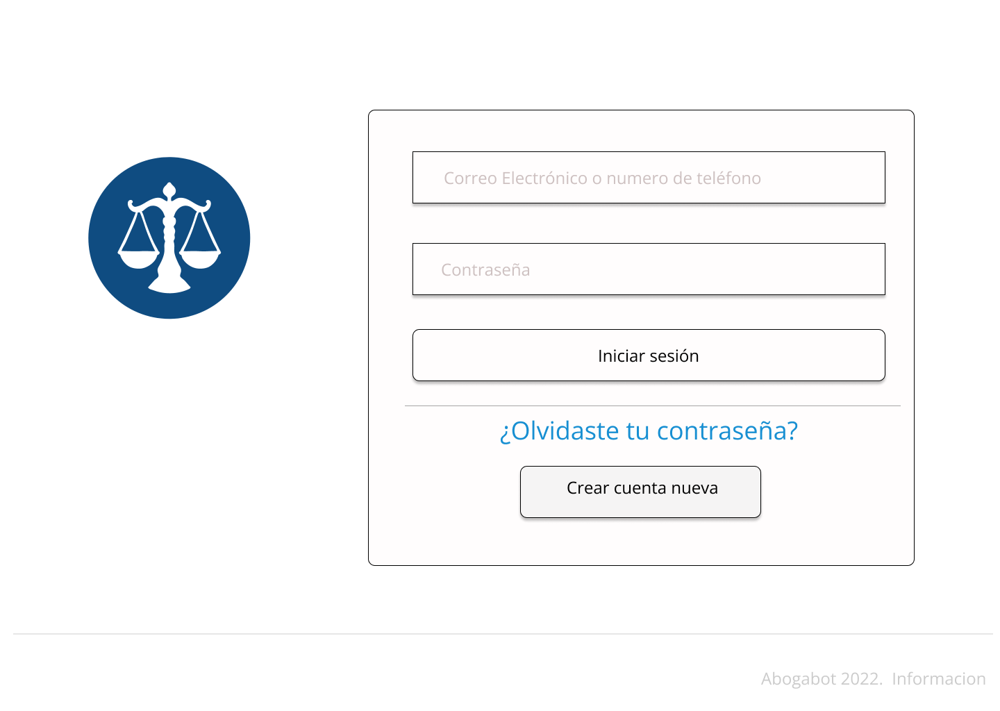
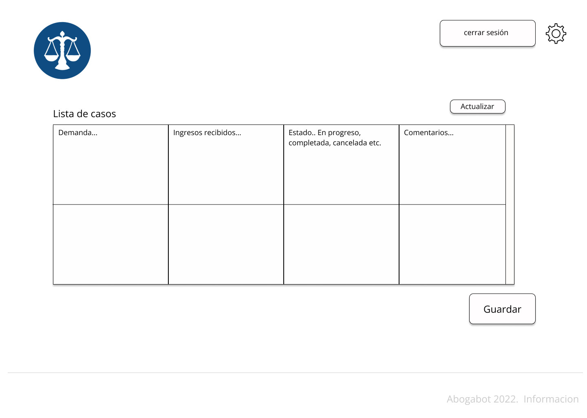
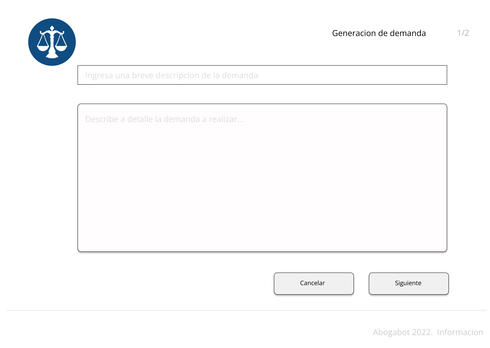

# Caso abogabot V1

**Descripcion**

- Es un despacho de abogados que quiere automatizar las demandas de sus clientes, esto lo harán a traves de una página web llenando un formulario.

- Al momento de llenar el formulario se manda al proceso de pago para finalizar la transacción.

- Para dar seguimiento a su demanda, el cliente crea una cuenta en la plataforma y verá el seguimiento de cada una de las actualizaciones del proceso legal.

- El administrador del sitio recbe la notificación de una nueva demanda y con los datos llenados del formulario se crea automaticamente el documento legal en formato word para empezar el proceso.

- El administrador recibe el pago y debe de ser capaz de verlo en un dashboard para ver la cantidad de ingresos recibidos.

- El administrador actualiza el proceso de la demanda y agrega comentarios en cada paso del proceso.

- Al usuario le llegan correos de notificación para saber el avance de su proceso.

- La página debe de ser responsive para poderla ver desde el celular.

- La preferencia de colores del cliente es azul marino y blanco, pero acepta propuestas.

---

## Requerimientos

**Como cliente** Requiere una plataforma web responsiva que conste con gestión de usuarios (login/signup) de un formulario para el llenado de una demanda y formulario para la realizacion del pago.

**Como administrador** Requiere tener la posibilidad de administrar los casos mediante un dashboard, tener la funcionalidad para consultar los ingresos obtenidos y editar el estado del caso y notificar al cliente del estado de la demanda. Desea que el sistema genere un documento word.

[Requerimientos detallados](https://github.com/ohmesz/PracticaFrontEndMission01/blob/main/practica01/Requerimientos_Abogabot.docx)

---

## Buyer persona

[Buyer persona](https://github.com/ohmesz/PracticaFrontEndMission01/blob/main/practica01/buyer_persona.pdf)

---

## Publico Objetivo

---

## Wireframes

https://miro.com/app/board/uXjVOIzbxEM=/?invite_link_id=616061070098

---

## UI

Sign up

Login

Inicio cliente

Inicio Administrador

Formulario de Demanda

Formulario de Pago

Confirmacion de pago

